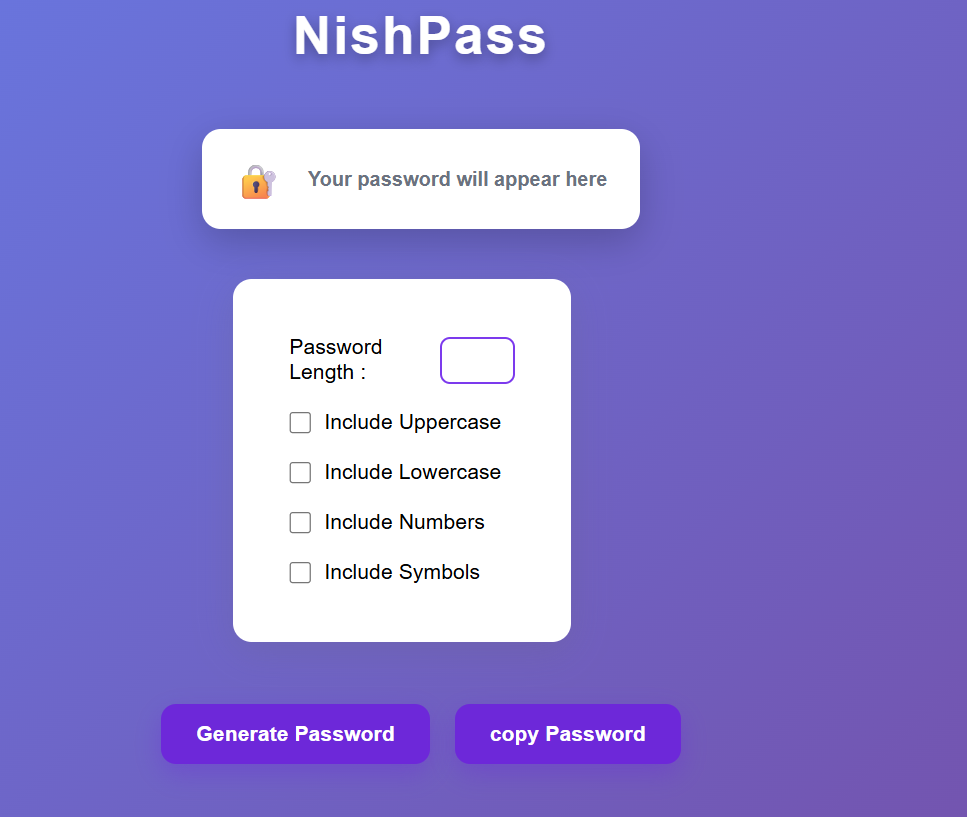

# 🔐 NishPass

A modern, responsive password generator built using **HTML**, **CSS**, and **JavaScript**.

NishPass helps users generate strong and secure passwords with customizable options such as uppercase letters, lowercase letters, numbers, and symbols.

---

## Features

- Generate random passwords
- Choose password length
- Include uppercase letters
- Include lowercase letters
- Include numbers
- Include special symbols
- Copy password to clipboard
- Responsive design for desktop and mobile
- Clean and modern user interface

---

## Built With

- HTML5
- CSS3
- JavaScript (Vanilla JS)

---

## Screenshot



---

## How to Use

1. Enter the desired password length.
2. Select the character types you want.
3. Click **Generate Password**.
4. Click **Copy Password** to copy it to your clipboard.

---

## 📂 Project Structure

```
NishPass/
│── index.html
│── style.css
│── script.js
│── README.md
└── images/
    └── nishpass.png
```

---

## Future Improvements

- Password strength indicator
- Show/Hide password option
- Light/Dark mode
- Password history
- One-click password regeneration
- Better copy notification

---

## 👨‍💻 Author

**Nishanth**

GitHub: https://github.com/NishanthAcharya

---

## 📄 License

This project is open source and available under the MIT License.
